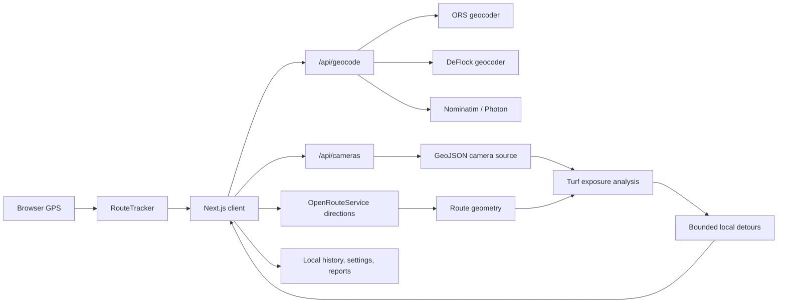

# FLOCKYOU

### AN OPEN SOURCE TO FREEDOM

FLOCKYOU is a mobile-first, camera-aware navigation application built with Next.js. It combines live browser GPS, address search, OpenRouteService driving directions, OpenStreetMap-based map tiles, and public camera-location data in one real-time map.

Plan a normal driving route, inspect public camera locations and their reported viewing directions, or ask FLOCKYOU to construct bounded local detours around camera view zones before rejoining the original route.

> [!IMPORTANT]
> FLOCKYOU is an experimental navigation tool, not a guarantee that a route is camera-free, legal, open, or safe. Camera records can be incomplete, stale, moved, incorrectly aimed, or missing. Always follow posted signs, road closures, traffic laws, and conditions in front of you.

## What It Does

- Searches addresses, businesses, and places with selectable results
- Uses the current GPS position or a typed starting address
- Requests driving routes, distance, ETA, and maneuver instructions
- Tracks the user continuously through the browser Geolocation API
- Smooths noisy GPS readings and snaps the display position to the active route
- Supports north-up, heading-up, and full-route map perspectives
- Provides speed-aware map zoom and look-ahead positioning
- Displays public cameras as directional beacons with animated 120-foot view zones
- Shows the next intersecting camera, its distance, direction, and freshness
- Builds local camera-aware detours that rejoin the original route
- Highlights modified detour segments in purple while preserving the base route in blue
- Rejects U-turn detours, repeated candidates, excessive detours, and routing loops
- Automatically checks for a safer reroute when the vehicle goes off route or approaches a newly detected camera
- Provides deduplicated turn and camera voice guidance
- Stores recent route history and avoided-camera totals locally
- Queues camera correction reports locally and exports them as JSON
- Includes day and night map styles, low-data mode, and a PWA application shell
- Adapts to desktop, portrait phone, and landscape phone layouts

## Core Experience

### Route Planning

The destination field is the primary search surface. Enter an address, business, landmark, or place name and select the intended result. The route can begin from:

- **My location** using live browser GPS
- **From address** using a second geocoded place

FLOCKYOU then requests a recommended `driving-car` route from OpenRouteService and renders its geometry, distance, ETA, and maneuvers on the map.

### DeFlock Routing

Selecting **DeFlock my route** starts from the normal OpenRouteService route. FLOCKYOU does not request a completely unrelated trip. It identifies camera exposures on the existing route, searches for bounded bypasses around those exposures, and splices successful bypasses back into the original route.

The current deterministic pipeline:

1. Builds a 120-foot camera zone for every relevant camera.
2. Uses a directional sector when a bearing is known and a circular zone when it is not.
3. Intersects those zones with the current route using Turf.
4. Sorts exposures by distance along the route.
5. Groups nearby exposures into the next local camera cluster.
6. Creates progressively larger detour windows around that cluster at 800, 1,600, 3,200, and 6,400 meters.
7. Requests a shortest local ORS route from the pre-camera route point to a later rejoin point.
8. Applies start and end bearings plus `continue_straight` to discourage reversals.
9. Passes the camera zones to ORS as avoidance polygons.
10. Rechecks every candidate against the complete loaded camera dataset, including cameras not currently drawn on screen.
11. Adds newly discovered candidate-route cameras to the avoidance set and retries.
12. Rejects candidates containing an ORS U-turn maneuver.
13. Rejects candidates that are excessively longer than the original local segment.
14. Rejects repeated candidates and repeated full-route signatures.
15. Splices a valid local bypass into the original route and repeats for the next exposure cluster.

The process is capped at 12 camera clusters, four candidate retries per window, and 50 cameras in a local avoidance set. These bounds prevent runaway requests, loops, and route thrashing.

If no connected legal bypass is found, FLOCKYOU returns to the standard route instead of presenting an unresolved route as clean. After a successful DeFlock operation, **Restore original route** remains available.

## Real-Time Navigation

FLOCKYOU uses `navigator.geolocation.watchPosition()` with high-accuracy updates. GPS samples pass through a route tracker that:

- Smooths normal location noise while allowing large legitimate position changes
- Derives heading from movement when the device does not provide one
- Scores nearby route segments using distance and heading
- Snaps the displayed position when accuracy is within an adaptive threshold
- Keeps route progress monotonic to reduce backward jumps
- Tracks the active maneuver and distance to the next turn
- Detects sustained off-route movement before requesting another route
- Applies cooldowns to prevent repeated rerouting

The navigation HUD includes the next maneuver, street instruction, live distance countdown, ETA, remaining distance, rerouting state, and the next camera threat.

### Voice Modes

- **Full** announces turns and camera alerts
- **Alerts** announces camera alerts only
- **Muted** disables speech

Guidance distances adjust with speed. Every announcement has a stable event key so the same turn stage or camera warning is not repeated continuously.

## Camera Layer

The camera layer accepts GeoJSON or gzipped GeoJSON through the server-side `/api/cameras` proxy. The default source is:

```text
https://data.dontgetflocked.com/cameras.geojson.gz
```

The source URL can be changed from the System panel or through `NEXT_PUBLIC_DEFLOCK_POINTS_URL`.

Camera controls include:

- **All visible** for cameras inside the current map viewport
- **Near route** for cameras near the active route corridor
- Directional beacon orientation based on reported bearing
- Directional or circular 120-foot camera zones
- Freshness labels derived from verification timestamps
- Camera name, source, distance, and bearing
- Low-data rendering limits for less capable devices

All loaded cameras are still considered by DeFlock routing even when the display is filtered or capped for performance.

### Camera Reports

Users can flag a record as:

- Missing
- Moved
- Incorrect direction
- Other

Reports are stored only in the current browser's `localStorage`. They are not submitted to a public moderation API. The System panel can export the pending queue as JSON for review or ingestion by a future backend.

## Search and Geocoding

The `/api/geocode` endpoint normalizes results from the first provider that returns usable data:

1. OpenRouteService geocoding when an ORS key is available
2. DeFlock geocoding
3. OpenStreetMap Nominatim
4. Photon by Komoot

Current GPS coordinates are passed as a proximity hint. Searches are limited to the United States in the current implementation.

## Technology

| Layer | Technology |
| --- | --- |
| Application | Next.js 16, React 19, TypeScript |
| Map rendering | Leaflet |
| Base map | CARTO raster tiles with OpenStreetMap data |
| Directions | OpenRouteService `driving-car` GeoJSON API |
| Spatial analysis | Turf 7 |
| GPS | Browser Geolocation API |
| Voice | Web Speech Synthesis API |
| Persistence | Browser `localStorage` |
| Installability | Web App Manifest and service worker |

## Architecture



### Important Files

```text
app/page.tsx                    Main map, search, routing, navigation, and UI
app/lib/deflock-routing.ts      Camera zones, exposure detection, and route splicing
app/lib/navigation-core.ts      GPS filtering, route matching, progress, and maneuvers
app/api/cameras/route.ts        HTTPS camera-feed proxy with gzip support
app/api/geocode/route.ts        Multi-provider geocoding fallback
app/globals.css                 Responsive cyber-ops interface and map overlays
app/manifest.ts                 PWA manifest
public/sw.js                    Same-origin application-shell cache
scripts/test-navigation.cjs     Synthetic navigation regression test
```

## Getting Started

### Requirements

- Node.js 20 or newer
- npm
- An OpenRouteService API key for driving directions
- A modern browser with geolocation support

### 1. Clone and install

```bash
git clone https://github.com/Stericallyhindered/flockyou.git
cd flockyou
npm install
```

### 2. Configure environment variables

Copy `.env.example` to `.env.local`:

```bash
cp .env.example .env.local
```

PowerShell:

```powershell
Copy-Item .env.example .env.local
```

Set the values:

```dotenv
NEXT_PUBLIC_OPENROUTESERVICE_API_KEY=your_ors_key
NEXT_PUBLIC_DEFLOCK_POINTS_URL=https://data.dontgetflocked.com/cameras.geojson.gz
```

Create an OpenRouteService account and key at [openrouteservice.org](https://openrouteservice.org/dev/#/signup).

The application can load the map and search with fallback providers without an ORS key, but driving directions and DeFlock routing require the key.

### 3. Start development

```bash
npm run dev
```

Open [http://localhost:3000](http://localhost:3000).

### 4. Verify the project

```bash
npm run test:navigation
npm run build
```

The navigation test simulates movement along a route and verifies snapped progress, maneuver advancement, and remaining distance.

## Environment Variables

| Variable | Required | Purpose |
| --- | --- | --- |
| `NEXT_PUBLIC_OPENROUTESERVICE_API_KEY` | For routing | Browser-side ORS geocoding and driving-direction requests |
| `NEXT_PUBLIC_DEFLOCK_POINTS_URL` | No | Overrides the default camera GeoJSON or `.geojson.gz` source |

Because the ORS key is currently a `NEXT_PUBLIC_` variable and directions are requested directly by the browser, the key is visible to users. For a public production deployment, proxy ORS requests through a server endpoint, add rate limiting, and keep the provider credential server-side.

## Production Deployment

Build and run the optimized server:

```bash
npm run build
npm start
```

Any Node-compatible Next.js host can run the application. Production deployments should use HTTPS because browser geolocation is restricted to secure contexts, with `localhost` as the development exception.

Before public deployment:

- Move the ORS API key behind a server-side route
- Restrict `/api/cameras` to an allowlist of trusted camera-data hosts
- Add request rate limiting and abuse protection
- Add a remote report moderation and submission API if community reporting is enabled
- Add monitoring for ORS quota failures and upstream camera-feed failures
- Review tile-provider and geocoder usage policies for expected traffic
- Add privacy, terms, and data-source attribution pages
- Add a repository license

## PWA and Offline Behavior

FLOCKYOU includes a web app manifest and service worker, allowing supported browsers to install it as a standalone application.

The service worker caches only the same-origin application shell and static assets. It intentionally excludes API responses and third-party map tiles. Consequently:

- The interface can reopen without a network connection after a successful visit
- Previously loaded application assets can remain available
- Live map tiles, geocoding, directions, and camera refresh still require network access
- FLOCKYOU is not currently a fully offline navigation system

## Local Data and Privacy

The application does not include an account system. Route history, voice preference, low-data preference, and camera reports are saved in browser `localStorage`.

Live location is used in the browser for map positioning, route matching, geocoding proximity, and routing requests. Start and destination coordinates are sent to OpenRouteService when a route is requested. Search text and optional proximity coordinates can be sent to the configured geocoding providers.

Clearing the site's browser storage removes locally saved history, preferences, and pending reports.

## Known Limitations

- Camera coverage and direction depend entirely on upstream public data
- A reported 120-foot view sector is a routing model, not a measured hardware specification for every installation
- Traffic-aware ETA and live road-closure data are not currently integrated
- Route quality and legal access depend on OpenRouteService and OpenStreetMap data
- Background GPS behavior varies by mobile browser and operating system
- Browser speech voices and timing vary by device
- Reports remain local until a moderation backend is connected
- The service worker does not cache map or camera tiles for offline navigation
- Geocoding is currently US-focused
- Long routes with many camera clusters can consume multiple ORS requests and API quota

## Data Sources and Attribution

- Camera data defaults to [dontgetflocked.com](https://dontgetflocked.com/)
- The original DeFlock API project is available at [FoggedLens/deflock](https://github.com/FoggedLens/deflock/tree/master/api)
- Directions and optional geocoding are provided by [OpenRouteService](https://openrouteservice.org/)
- Map data is provided by [OpenStreetMap contributors](https://www.openstreetmap.org/copyright)
- Base-map styling and raster delivery are provided by [CARTO](https://carto.com/attributions)
- Geocoding fallbacks include [Nominatim](https://nominatim.org/) and [Photon](https://photon.komoot.io/)

Respect each provider's license, attribution, rate limits, and acceptable-use policy when deploying a public instance.

## Contributing

Contributions should preserve the central routing guarantees:

- DeFlock changes remain local and rejoin the original route
- Every candidate is checked against all loaded camera records
- Failed avoidance never masquerades as a clean route
- U-turns, loops, and repeated reroutes remain bounded
- Navigation changes include synthetic GPS regression coverage
- Mobile portrait and landscape layouts remain usable

Recommended workflow:

```bash
git checkout -b feature/short-description
npm run test:navigation
npm run build
git commit -m "Describe the change"
```

Open an issue before a large routing rewrite so behavior, test routes, and failure handling can be agreed on first.

## Responsible Use

FLOCKYOU is intended to make public infrastructure information understandable and navigable. Do not interact with, obstruct, damage, or trespass near camera equipment. Do not follow a suggested maneuver when it conflicts with road signs, emergency instructions, closures, or safe driving.

Do not operate the interface while actively controlling a vehicle. Configure the destination before driving or use a passenger.

## License

No license file is currently included. Until a license is added, copyright law reserves reuse and redistribution rights to the repository owner even if the source is publicly visible.

Choose and add an open-source license before accepting outside redistribution or contributions.
